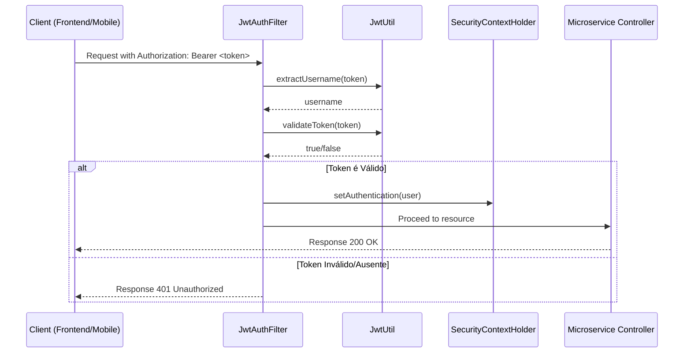

# 🔐 JWT Package - Microservices Security Library

[](https://spring.io/projects/spring-boot)
[](https://www.oracle.com/java/technologies/javase/jdk21-archive-downloads.html)
[](LICENSE)

O `jwt-package` é uma biblioteca modular desenvolvida em Java 21 e Spring Boot para simplificar a implementação de segurança baseada em **JSON Web Tokens (JWT)** em arquiteturas de microserviços.

---

## 🎯 Objetivo e Problema Solvido

Em arquiteturas de microserviços, a autenticação e autorização descentralizadas podem levar a redundância de código e inconsistências de segurança. 

Este projeto resolve esse problema ao fornecer um pacote reutilizável que:
1.  **Padroniza** a validação de tokens JWT entre diferentes serviços.
2.  **Reduz o Boilerplate**: Automatiza a configuração do filtro de segurança e utilitários de token.
3.  **Facilita a Integração**: Pronto para ser injetado como uma dependência em qualquer microserviço Spring Boot.

---

## 🏗️ Arquitetura e Fluxo de Autenticação

O diagrama abaixo ilustra como a biblioteca intercepta as requisições para validar a identidade do usuário antes de chegar aos recursos protegidos.



---

## 🚀 Tecnologias Utilizadas

- **Java 21**: Aproveitando as últimas melhorias de performance e sintaxe.
- **Spring Boot 4.0.2**: Base sólida para aplicações modernas.
- **Spring Security**: Gerenciamento de filtros e contexto de autenticação.
- **JJWT (Java JWT)**: Biblioteca robusta para criação e parsing de tokens.

---

## ⚙️ Configuração

Para utilizar esta biblioteca no seu projeto, adicione as seguintes propriedades ao seu `application.properties` ou `application.yml`:

```properties
# Chave secreta para assinatura dos tokens (mantenha em segurança!)
secret.key=sua_chave_secreta_super_segura_aqui_projeto_jwt_package
```

### Dependências (pom.xml)

Certifique-se de que as dependências do JJWT estão presentes:

```xml
<dependency>
    <groupId>io.jsonwebtoken</groupId>
    <artifactId>jjwt-api</artifactId>
    <version>0.11.5</version>
</dependency>
<dependency>
    <groupId>io.jsonwebtoken</groupId>
    <artifactId>jjwt-impl</artifactId>
    <version>0.11.5</version>
    <scope>runtime</scope>
</dependency>
```

---

## 🛠️ Como Usar

### 1. JwtUtil
Utilize esta classe para gerenciar o ciclo de vida do token.

```java
@Autowired
private JwtUtil jwtUtil;

// Gerar um token
String token = jwtUtil.generateToken("usuario_exemplo");

// Validar um token
boolean isValid = jwtUtil.validateToken(token);

// Extrair username
String username = jwtUtil.extractUsername(token);
```

### 2. Filtro de Segurança
O `JwtAuthFilter` já está configurado para interceptar requisições. Ele ignora automaticamente rotas de documentação como Swagger e Actuator, facilitando o desenvolvimento.

---

## 🧪 Testes

Para garantir a confiabilidade, execute o conjunto de testes automatizados:

```bash
mvn test
```

---

*Desenvolvido por Roberto Lara / @betolara1 - 2026*
