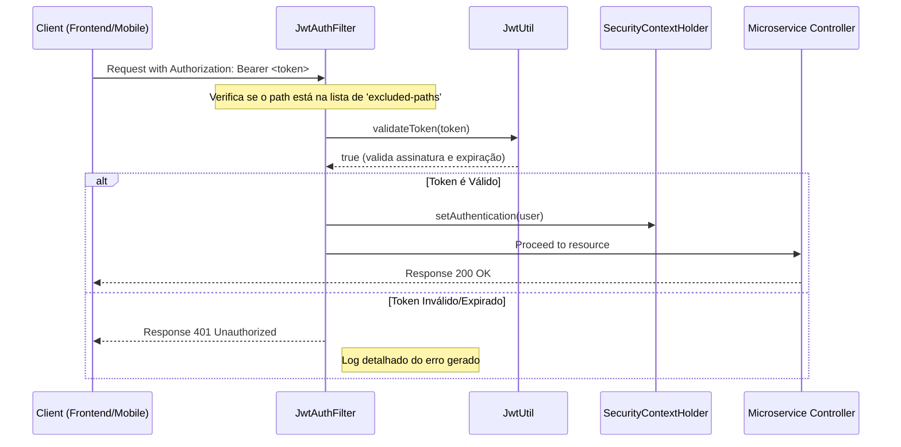

# 🔐 JWT Package - Microservices Security Library

[](https://spring.io/projects/spring-boot)
[](https://www.oracle.com/java/technologies/javase/jdk21-archive-downloads.html)
[](LICENSE)

O `jwt-package` é uma biblioteca modular e de alta performance desenvolvida em Java 21 e Spring Boot para simplificar a implementação de segurança baseada em **JSON Web Tokens (JWT)** em arquiteturas de microserviços.

---

## 🎯 Objetivo e Problema Solvido

Em arquiteturas de microserviços, a autenticação e autorização descentralizadas podem levar a redundância de código e inconsistências de segurança. 

Este projeto fornece um pacote reutilizável que:
1.  **Auto-configuração (Plug & Play)**: O Spring Boot detecta e configura a biblioteca automaticamente.
2.  **Performance Otimizada**: Cache de chaves de assinatura para reduzir o uso de CPU.
3.  **Observabilidade**: Logging detalhado com SLF4J para rastreio de tokens inválidos ou expirados.
4.  **Flexibilidade Total**: Método genérico para extração de qualquer Claim customizada.

---

## 🏗️ Arquitetura e Fluxo


```mermaid
sequenceDiagram
    participant C as Client (Frontend/Mobile)
    participant F as JwtAuthFilter
    participant U as JwtUtil
    participant S as SecurityContextHolder
    participant API as Microservice Controller

    C->>F: Request with Authorization: Bearer <token>
    Note over F: Verifica se o path está na lista de 'excluded-paths'
    F->>U: validateToken(token)
    U-->>F: true (valida assinatura e expiração)
    
    ALT Token é Válido
        F->>S: setAuthentication(user)
        F->>API: Proceed to resource
        API-->>C: Response 200 OK
    ELSE Token Inválido/Expirado
        F-->>C: Response 401 Unauthorized
        Note right of F: Log detalhado do erro gerado
    END
```

---

## ⚙️ Configuração

Para utilizar esta biblioteca, adicione as propriedades ao seu `application.properties` ou `application.yml`. O pacote utiliza **Type-safe Configuration** com validação automática.

### Parâmetros de Configuração (Prefixo: `jwt.*`)

| Propriedade | Descrição | Valor Padrão |
| :--- | :--- | :--- |
| `jwt.secret-key` | Chave secreta de assinatura (mín. 32 chars) | (Obrigatório) |
| `jwt.expiration-time` | Tempo de vida em **milisegundos** | 86400000 (24h) |
| `jwt.excluded-paths` | Lista de URLs públicas (AntPathMatcher) | (Vazio) |
| `jwt.filter.enabled` | Ativa/Desativa o filtro de segurança | `true` |

#### Exemplo no `application.properties`:
```properties
jwt.secret-key=minha_chave_secreta_super_longa_e_segura_32_chars
jwt.excluded-paths=/public/**, /auth/login, /swagger-ui/**
jwt.expiration-time=43200000 
```

---

## 🛠️ Funcionalidades e Uso

### 1. Gestão de Tokens (`JwtUtil`)

O `JwtUtil` agora oferece métodos genéricos para máxima flexibilidade.

```java
@Autowired
private JwtUtil jwtUtil;

// 1. Gerar token simples
String token = jwtUtil.generateToken("usuario");

// 2. Gerar com Claims Customizados
Map<String, Object> claims = new HashMap<>();
claims.put("role", "ADMIN");
String tokenComplexo = jwtUtil.generateToken("usuario", claims);

// 3. Extração Genérica (Poderoso!)
Date exp = jwtUtil.extractClaim(token, Claims::getExpiration);
String role = jwtUtil.extractClaim(token, c -> c.get("role", String.class));
```

### 2. Filtro de Segurança (`JwtAuthFilter`)

- **Plug & Play**: Sem necessidade de `@ComponentScan`. Adicione a lib e use.
- **Segurança Stateless**: Integração nativa com `SecurityContextHolder`.
- **CORS Friendly**: Libera automaticamente requisições do tipo `OPTIONS`.

---

## 🧪 Testes Automatizados

A biblioteca é protegida por uma suíte de testes unitários que cobre:
- Geração e validação de tokens com e sem claims.
- Validação de expiração e chaves inválidas.
- Lógica de exclusão de caminhos e bypass do filtro.

```bash
mvn test
```

---

*Desenvolvido por Roberto Lara / @betolara1 - 2026*
