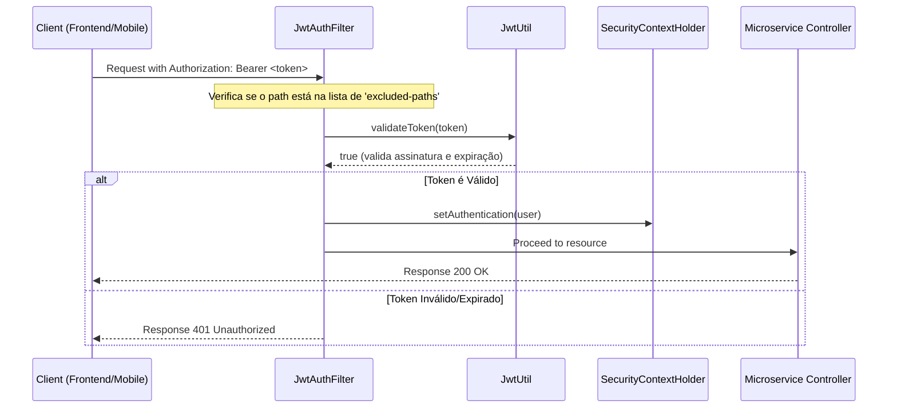

# 🔐 JWT Package - Microservices Security Library

[](https://spring.io/projects/spring-boot)
[](https://www.oracle.com/java/technologies/javase/jdk21-archive-downloads.html)
[](LICENSE)

O `jwt-package` é uma biblioteca modular desenvolvida em Java 21 e Spring Boot para simplificar a implementação de segurança baseada em **JSON Web Tokens (JWT)** em arquiteturas de microserviços.

---

## 🎯 Objetivo e Problema Solvido

Em arquiteturas de microserviços, a autenticação e autorização descentralizadas podem levar a redundância de código e inconsistências de segurança. 

Este projeto fornece um pacote reutilizável que:
1.  **Padroniza** a validação de tokens JWT.
2.  **Reduz o Boilerplate**: Automatiza a configuração do filtro de segurança e utilitários.
3.  **Flexibilidade Total**: Permite configurar rotas públicas dinamicamente por serviço.

---

## 🏗️ Arquitetura e Fluxo


```mermaid
sequenceDiagram
    participant C as Client (Frontend/Mobile)
    participant F as JwtAuthFilter
    participant U as JwtUtil
    participant S as SecurityContextHolder
    participant API as Microservice Controller

    C->>F: Request with Authorization: Bearer <token>
    Note over F: Verifica se o path está na lista de 'excluded-paths'
    F->>U: validateToken(token)
    U-->>F: true (valida assinatura e expiração)
    
    ALT Token é Válido
        F->>S: setAuthentication(user)
        F->>API: Proceed to resource
        API-->>C: Response 200 OK
    ELSE Token Inválido/Expirado
        F-->>C: Response 401 Unauthorized
    END
```

---

## ⚙️ Configuração

Para utilizar esta biblioteca, adicione as seguintes propriedades ao seu `application.properties` ou `application.yml`:

### Parâmetros de Configuração

| Propriedade | Descrição | Valor Padrão |
| :--- | :--- | :--- |
| `secret.key` | Chave secreta para assinatura (mín. 32 chars) | (Obrigatório) |
| `jwt.excluded-paths` | Lista de URLs públicas (AntPathMatcher) | (Vazio) |
| `jwt.expiration-time` | Tempo de vida do token em **milisegundos** | 86400000 (24h) |

#### Exemplo no `application.properties`:
```properties
secret.key=minha_chave_secreta_super_longa_e_segura
jwt.excluded-paths=/public/**, /auth/login
jwt.expiration-time=43200000  # Define para 12 horas
```

#### Tabela de Referência (Milisegundos):
- **1 hora**: `3600000`
- **12 horas**: `43200000`
- **24 horas**: `86400000`
- **7 dias**: `604800000`

- Obs: Se não for informado o valor padrão será de 24 horas.


### Dependências Recomendadas (pom.xml)

A biblioteca utiliza o JJWT. Certifique-se de ter as implementações de runtime no seu projeto se elas não forem puxadas automaticamente:

```xml
<dependency>
    <groupId>io.jsonwebtoken</groupId>
    <artifactId>jjwt-api</artifactId>
    <version>0.11.5</version>
</dependency>
<dependency>
    <groupId>io.jsonwebtoken</groupId>
    <artifactId>jjwt-impl</artifactId>
    <version>0.11.5</version>
    <scope>runtime</scope>
</dependency>
```

---

## 🛠️ Funcionalidades

### 1. Gestão de Tokens (`JwtUtil`)
O token agora possui **expiração automática de 24 horas**.

```java
@Autowired
private JwtUtil jwtUtil;

// Gerar um token com expiração
String token = jwtUtil.generateToken("usuario_exemplo");

// Validar assinatura e tempo de expiração
boolean isValid = jwtUtil.validateToken(token);
```

### 2. Filtro Inteligente (`JwtAuthFilter`)
- **Auto-ignora OPTIONS**: Requisições de Pre-flight (CORS) são liberadas automaticamente.
- **Configuração Dinâmica**: Usa `AntPathMatcher` para validar os caminhos definidos em `jwt.excluded-paths`.
- **Stateless**: Autentica o usuário no contexto do Spring Security sem necessidade de consulta ao banco de dados em cada request.

---

## 🧪 Testes Automatizados

A biblioteca conta com uma suíte de testes unitários cobrindo:
- Geração e validação de tokens.
- Extração de Claims.
- Lógica de exclusão de caminhos do filtro.

Para rodar os testes:
```bash
mvn test
```

---

*Desenvolvido por Roberto Lara / @betolara1 - 2026*
