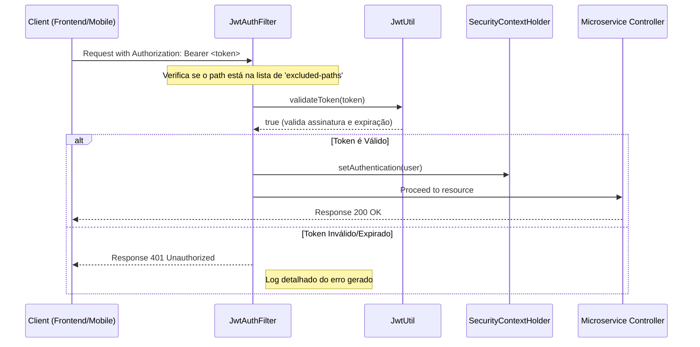

<div align="center">

# 🔐 JWT Package

### Biblioteca Modular de Segurança para Microserviços Spring Boot

[](https://www.oracle.com/java/)
[](https://spring.io/projects/spring-boot)
[](LICENSE)
[](https://jwt.io/)

</div>

---

## 📸 Fluxo de Autenticação

<div align="center">


```mermaid
sequenceDiagram
    participant C as Client (Frontend/Mobile)
    participant F as JwtAuthFilter
    participant U as JwtUtil
    participant S as SecurityContextHolder
    participant API as Microservice Controller

    C->>F: Request with Authorization: Bearer <token>
    Note over F: Verifica se o path está na lista de 'excluded-paths'
    F->>U: validateToken(token)
    U-->>F: true (valida assinatura e expiração)
    
    ALT Token é Válido
        F->>S: setAuthentication(user)
        F->>API: Proceed to resource
        API-->>C: Response 200 OK
    ELSE Token Inválido/Expirado
        F-->>C: Response 401 Unauthorized
        Note right of F: Log detalhado do erro gerado
    END
```

</div>

---

## 📌 Sobre o Projeto

O **jwt-package** é uma biblioteca modular e de alta performance desenvolvida para simplificar a implementação de segurança baseada em **JSON Web Tokens (JWT)** em arquiteturas de microserviços. 

Construída para ser **Plug & Play**, ela resolve o problema de redundância de código e inconsistências de segurança em sistemas distribuídos, fornecendo uma base sólida e reutilizável para qualquer projeto Spring Boot.

### Principais Diferenciais:

- ✅ **Auto-configuração completa**: O Spring Boot detecta e configura a biblioteca automaticamente.
- ✅ **Performance Otimizada**: Cache de chaves de assinatura e extração eficiente de claims.
- ✅ **Observabilidade**: Logging detalhado com SLF4J para rastreio de tokens inválidos ou expirados.
- ✅ **Flexibilidade Total**: Métodos genéricos para extração de qualquer Claim customizada.
- ✅ **Segurança Stateless**: Integração nativa com o `SecurityContextHolder`.

---

## 🏛️ Arquitetura

```
📦 jwt-package
 ├── ⚙️ config/              # Configurações centrais
 │    ├── JwtAutoConfiguration # Ativação automática da biblioteca
 │    ├── JwtProperties        # Mapeamento de propriedades (application.yml)
 │    └── SecurityConfig       # Configurações de Beans e Segurança
 └── 🔐 security/            # Lógica de segurança
      ├── JwtAuthFilter        # Filtro de interceptação de requisições
      └── JwtUtil              # Utilitário para gestão de tokens
```

---

## ⚙️ Configuração

Adicione as propriedades ao seu `application.properties` ou `application.yml`. A biblioteca utiliza **Type-safe Configuration** com validação automática.

### Parâmetros (Prefixo: `jwt.*`)

| Propriedade | Descrição | Valor Padrão |
| :--- | :--- | :--- |
| `jwt.secret-key` | Chave secreta de assinatura (mín. 32 chars) | **(Obrigatório)** |
| `jwt.expiration-time` | Tempo de vida em **milisegundos** | `86400000` (24h) |
| `jwt.excluded-paths` | Lista de URLs públicas (AntPathMatcher) | `(Vazio)` |
| `jwt.filter.enabled` | Ativa/Desativa o filtro de segurança | `true` |

#### Exemplo:
```properties
jwt.secret-key=minha_chave_secreta_super_longa_e_segura_32_chars
jwt.excluded-paths=/public/**, /auth/login, /swagger-ui/**
jwt.expiration-time=43200000 
```

---

## 🚀 Funcionalidades e Uso

### 1. Gestão de Tokens (`JwtUtil`)
O `JwtUtil` oferece métodos genéricos e de fácil integração.

```java
@Autowired
private JwtUtil jwtUtil;

// Gerar token simples
String token = jwtUtil.generateToken("usuario");

// Gerar com Claims Customizados
Map<String, Object> claims = new HashMap<>();
claims.put("role", "ADMIN");
String tokenComplexo = jwtUtil.generateToken("usuario", claims);

// Extração Genérica (Poderoso!)
Date exp = jwtUtil.extractClaim(token, Claims::getExpiration);
String role = jwtUtil.extractClaim(token, c -> c.get("role", String.class));
```

### 2. Filtro de Segurança (`JwtAuthFilter`)
- **Zero Config**: Funciona imediatamente após adicionar a dependência.
- **CORS Friendly**: Libera automaticamente requisições do tipo `OPTIONS`.
- **Stateless**: Não mantém estado no servidor, ideal para escalabilidade.

---

## 🧪 Testes

A biblioteca possui uma suíte de testes unitários robusta para garantir a confiabilidade:

| Cobertura | Descrição |
|-----------|-----------|
| **Geração** | Valida criação de tokens com e sem claims |
| **Validação** | Checa expiração e chaves inválidas |
| **Bypass** | Testa lógica de exclusão de caminhos |

```bash
mvn test
```

---

## 🛠️ Stack Tecnológica

| Tecnologia | Versão | Finalidade |
|-----------|--------|------------|
| Java | 21 (LTS) | Linguagem principal |
| Spring Boot | 3.4.3 | Framework base e Auto-config |
| JJWT | 0.11.5 | Manipulação de tokens JWT |
| Lombok | — | Redução de boilerplate |
| JUnit 5 | — | Testes unitários |
| Maven | 3.9 | Gerenciamento de build |

---

## 👨‍💻 Autor

Desenvolvido por **Beto Lara** — Backend Developer

[](https://github.com/betolara1)

---

<div align="center">

**JWT Package** — Segurança simplificada para arquiteturas modernas.

</div>
