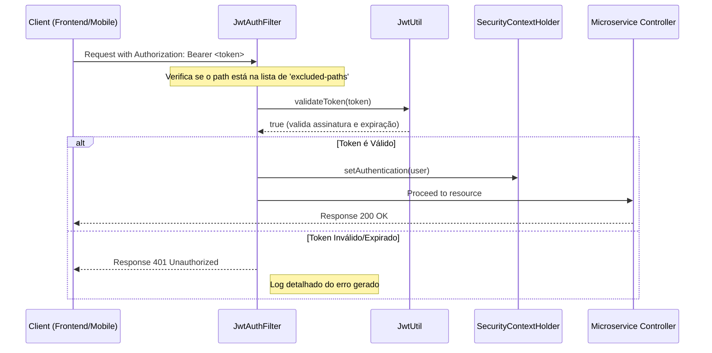

<div align="center">

# 🔐 JWT Package

### Biblioteca Modular de Segurança para Microserviços Spring Boot

[](https://www.oracle.com/java/)
[](https://spring.io/projects/spring-boot)
[](LICENSE)
[](https://jwt.io/)

</div>

---

## 📸 Fluxo de Autenticação

<div align="center">


```mermaid
sequenceDiagram
    participant C as Client (Frontend/Mobile)
    participant F as JwtAuthFilter
    participant U as JwtUtil
    participant S as SecurityContextHolder
    participant API as Microservice Controller

    C->>F: Request with Authorization: Bearer <token>
    Note over F: Verifica se o path está na lista de 'excluded-paths'
    F->>U: validateToken(token)
    U-->>F: true (valida assinatura e expiração)
    
    ALT Token é Válido
        F->>S: setAuthentication(user)
        F->>API: Proceed to resource
        API-->>C: Response 200 OK
    ELSE Token Inválido/Expirado
        F-->>C: Response 401 Unauthorized
        Note right of F: Log detalhado do erro gerado
    END
```

</div>

---

## 📌 Sobre o Projeto

O **jwt-package** é uma biblioteca modular e de alta performance desenvolvida para simplificar a implementação de segurança baseada em **JSON Web Tokens (JWT)** em arquiteturas de microserviços. 

Construída para ser **Plug & Play**, ela resolve o problema de redundância de código e inconsistências de segurança em sistemas distribuídos, fornecendo uma base sólida e reutilizável para qualquer projeto Spring Boot.

### Principais Diferenciais:

- ✅ **Auto-configuração completa**: O Spring Boot detecta e configura a biblioteca automaticamente.
- ✅ **Performance Otimizada**: Cache de chaves de assinatura e extração eficiente de claims.
- ✅ **Observabilidade**: Logging detalhado com SLF4J para rastreio de tokens inválidos ou expirados.
- ✅ **Flexibilidade Total**: Métodos genéricos para extração de qualquer Claim customizada.
- ✅ **Segurança Stateless**: Integração nativa com o `SecurityContextHolder`.

---

## 🏛️ Arquitetura

```
📦 jwt-package
 ├── ⚙️ config/              # Configurações centrais
 │    ├── JwtAutoConfiguration # Ativação automática da biblioteca
 │    ├── JwtProperties        # Mapeamento de propriedades (application.yml)
 │    └── SecurityConfig       # Configurações de Beans e Segurança
 └── 🔐 security/            # Lógica de segurança
      ├── JwtAuthFilter        # Filtro de interceptação de requisições
      └── JwtUtil              # Utilitário para gestão de tokens
```

---

## 🚀 Como Usar no Seu Projeto (Passo a Passo)

A integração do **jwt-package** em outro microserviço é projetada para ser simples e exigir o mínimo de código boilerplate possível. Siga os passos abaixo:

### Passo 1: Instalação da Dependência

Adicione a biblioteca ao seu `pom.xml`. *(Certifique-se de ter as credenciais do GitHub Packages configuradas no seu `settings.xml`, se aplicável)*.

```xml
<dependency>
    <groupId>com.betolara1</groupId>
    <artifactId>JWT-Package</artifactId>
    <version>1.0.3</version> <!-- Substitua pela versão atual -->
</dependency>
```

### Passo 2: Configuração do `application.properties` (Obrigatório)

No seu projeto destino, você **precisa** definir a chave secreta e, opcionalmente, configurar caminhos públicos (que não exigem token) e o tempo de expiração. O filtro de segurança fará a leitura automática destas variáveis.

| Propriedade | Descrição | Valor Padrão |
| :--- | :--- | :--- |
| `jwt.secret-key` | Chave secreta de assinatura (mín. 32 chars) | **(Obrigatório)** |
| `jwt.expiration-time` | Tempo de vida em **milisegundos** | `86400000` (24h) |
| `jwt.excluded-paths` | Lista de URLs públicas separadas por vírgula | `(Vazio)` |
| `jwt.filter.enabled` | Ativa/Desativa o filtro de segurança da lib | `true` |

**Exemplo no seu `application.properties`**:
```properties
# Chave secreta (Obrigatório)
jwt.secret-key=minha_chave_secreta_super_longa_e_segura_32_chars

# Tempo de expiração (Opcional - Padrão 24h)
jwt.expiration-time=43200000 

# Rotas públicas que NÃO precisam de token (Opcional mas muito recomendado)
jwt.excluded-paths=/auth/login, /public/**, /swagger-ui/**
```

### Passo 3: Geração de Token (Ex: Endpoint de Login)

A biblioteca **não** cuida de checar banco de dados ou validar senhas. Isso fica a cargo do seu projeto!
O que você precisa fazer é: no seu `AuthController`, após validar as credenciais do usuário, você utiliza o `JwtUtil` (já injetado automaticamente pelo Spring) para gerar o token.

```java
import com.bartz.jwt.security.JwtUtil;
import org.springframework.web.bind.annotation.*;
import org.springframework.beans.factory.annotation.Autowired;

@RestController
@RequestMapping("/auth")
public class AuthController {

    @Autowired
    private JwtUtil jwtUtil; // Injetado automaticamente!

    @PostMapping("/login")
    public String login(@RequestBody LoginRequest request) {
        // 1. Valide o usuário e senha no seu banco de dados
        boolean isValido = meuServicoDeAuth.validarCredenciais(request.getUsername(), request.getPassword());
        
        if (isValido) {
            // 2. Gere o Token simples
            return jwtUtil.generateToken(request.getUsername());
            
            // OU gere um token com dados (Claims) extras!
            // Map<String, Object> claims = new HashMap<>();
            // claims.put("role", "ADMIN");
            // return jwtUtil.generateToken(request.getUsername(), claims);
        }
        throw new RuntimeException("Credenciais inválidas");
    }
}
```

### Passo 4: O Que a Biblioteca Faz Sozinha? (O que NÃO precisa criar)

Graças a arquitetura **Plug & Play**, no seu projeto destino **VOCÊ NÃO PRECISA**:
- ❌ Criar um `SecurityFilterChain` genérico para validar Tokens.
- ❌ Criar o filtro de Requests (`OncePerRequestFilter`).
- ❌ Configurar CORS ou gerenciamento Stateless (A lib já configura isso para você).

O `JwtAuthFilter` da biblioteca interceptará automaticamente **todas** as requisições, verificará as rotas que você colocou em `jwt.excluded-paths` e validará o Token do Header `Authorization: Bearer <token>`.

### Passo 5: Recuperando o Usuário Logado

Nos seus outros controllers (que já estão protegidos pelo filtro), você pode saber quem fez a requisição diretamente através do contexto de segurança do Spring.

```java
import org.springframework.security.core.context.SecurityContextHolder;
import org.springframework.web.bind.annotation.GetMapping;
import org.springframework.web.bind.annotation.RestController;

@RestController
public class MeuController {

    @GetMapping("/meus-dados")
    public String getMeusDados() {
        // A biblioteca já salvou o nome do usuário logado no contexto!
        String usernameLogado = SecurityContextHolder.getContext().getAuthentication().getName();
        return "Dados protegidos do usuário: " + usernameLogado;
    }
}
```

---

## 🧪 Testes

A biblioteca possui uma suíte de testes unitários robusta para garantir a confiabilidade:

| Cobertura | Descrição |
|-----------|-----------|
| **Geração** | Valida criação de tokens com e sem claims |
| **Validação** | Checa expiração e chaves inválidas |
| **Bypass** | Testa lógica de exclusão de caminhos |

```bash
mvn test
```

---

## 🛠️ Stack Tecnológica

| Tecnologia | Versão | Finalidade |
|-----------|--------|------------|
| Java | 21 (LTS) | Linguagem principal |
| Spring Boot | 3.4.3 | Framework base e Auto-config |
| JJWT | 0.11.5 | Manipulação de tokens JWT |
| Lombok | — | Redução de boilerplate |
| JUnit 5 | — | Testes unitários |
| Maven | 3.9 | Gerenciamento de build |

---

## 👨‍💻 Autor

Desenvolvido por **Beto Lara** — Backend Developer

[](https://github.com/betolara1)

---

<div align="center">

**JWT Package** — Segurança simplificada para arquiteturas modernas.

</div>
